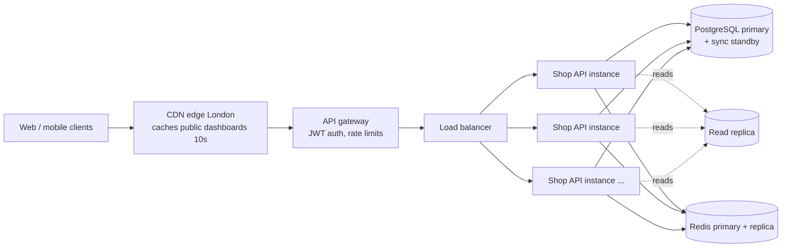
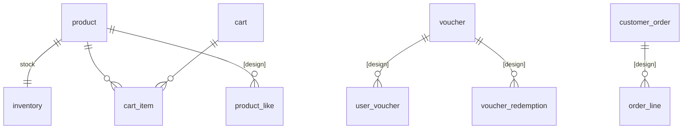
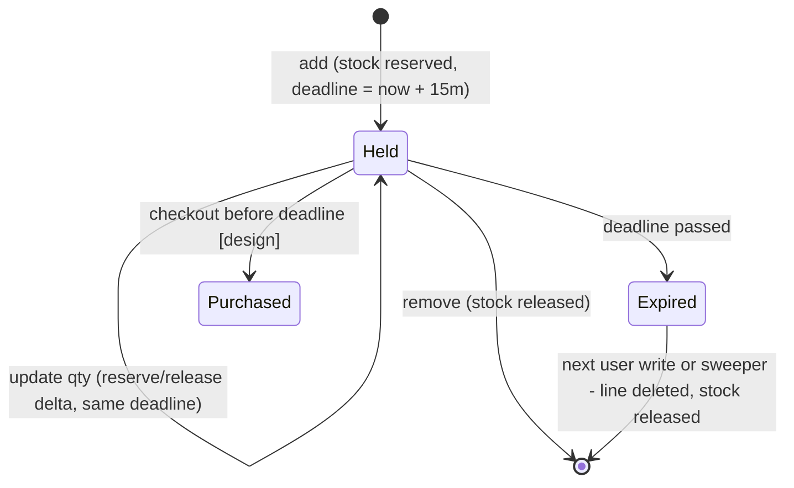

# Online Shop API — Design

This document explains the design of all four dashboards and the shopping cart:
**database, transactions, API, and distribution**. The parts marked
**[implemented]** exist in this repository with unit and integration tests; the
parts marked **[design]** are specified here but not coded.

| Area | Status |
|---|---|
| Cart: add / update / remove, 15-minute hold for high-demand items | **[implemented]** |
| Popular items dashboard (heavy load) | **[implemented]** |
| New items dashboard (heavy load) | **[implemented]** |
| Product creation (needed to feed "new items") | **[implemented]** |
| Liked items dashboard | **[design]** |
| Applicable vouchers / discounts dashboard | **[design]** |
| Checkout (consumes holds) | **[design]** |

---

## 1. Requirements and assumptions

**Functional**
1. Dashboard of items the user likes.
2. Dashboard of discounts / vouchers applicable *right now*.
3. Dashboard of popular items.
4. Dashboard of new items.
5. Cart API: add, update, remove items before purchase.
6. High-demand items: the user has 15 minutes to buy, then the item leaves the cart.

**Non-functional / assumptions**
- **One location (London).** One cloud region (e.g. GCP `europe-west2` / AWS `eu-west-2`), spread over 3 zones. No multi-region writes, so no cross-region consistency problems. Business dates ("today", campaign windows, popularity days) use `Europe/London`, including BST/GMT switches; timestamps are stored as UTC `timestamptz`.
- **Heavy load on popular and new items.** These two endpoints are the same for every user, so they are designed to be served from caches (CDN → in-process → Redis/DB) and never hit the database per request.
- **Correctness over availability for stock.** A high-demand item must never be oversold, even under a stampede.
- **Authentication is done by the API gateway**, which validates the JWT and forwards the subject as `X-User-Id`. The service trusts that header only from the gateway (network policy / mTLS).
- Indicative scale used for sizing: ~1M daily users, peaks of ~5k req/s on dashboards and ~500 req/s of cart writes, with flash-sale bursts of thousands of users on one product.

---

## 2. Architecture



- **Stateless API instances** (Spring Boot, Java 21), horizontally scaled on CPU / request rate (Cloud Run, GKE or ECS). Any instance can serve any request; background jobs run on every instance and coordinate through the database (see §6.5), so there is no leader election.
- **PostgreSQL** is the system of record for catalog, inventory, carts, likes, vouchers and orders. It is chosen because the hold logic needs atomic conditional updates, row locks and `SKIP LOCKED`, all of which it does well.
- **Redis** holds derived, rebuildable data only: popularity counters and the popularity ranking. Losing Redis degrades dashboards; it never loses orders or stock.
- **Modular monolith.** Code is split by feature (`catalog`, `inventory`, `cart`, `dashboard`) with dependencies in one direction. Each module can later become its own service (e.g. dashboards as a read-only service on replicas) without redesign; starting as one deployable keeps transactions simple, which matters most for the cart.

---

## 3. API

Base path `/api/v1`. JSON, money as decimal strings/numbers in GBP. Errors use RFC 9457 problem details with a stable `code`.

### 3.1 Dashboards

| Method & path | Auth | Cache | Description |
|---|---|---|---|
| `GET /dashboards/popular?limit=20` | public | `Cache-Control: public, max-age=10` | **[implemented]** Most added-to-cart items over the last 7 London days. `limit` 1–50. |
| `GET /dashboards/new?limit=20` | public | `Cache-Control: public, max-age=10` | **[implemented]** Newest active products. `limit` 1–50. |
| `GET /dashboards/liked?limit=20&cursor=…` | user | `private, no-store` | **[design]** Items the user liked, newest like first, cursor pagination. |
| `PUT /likes/{productId}` / `DELETE /likes/{productId}` | user | – | **[design]** Like / unlike (idempotent). |
| `GET /dashboards/vouchers` | user | `private, max-age=30` | **[design]** Vouchers the user can use now; each flagged `appliesToCart` if it would apply to the current cart. |

Response (popular / new):
```json
{ "type": "POPULAR",
  "items": [ { "id": 5, "sku": "BOOK-JAVA", "name": "Modern Java in Practice", "category": "books",
               "price": 39.00, "currency": "GBP", "highDemand": false, "createdAt": "2026-10-01T09:55:00Z" } ] }
```
Stock levels are deliberately not on dashboards: they change every second and would make a cached response wrong.

### 3.2 Cart [implemented]

| Method & path | Body | Success | Errors |
|---|---|---|---|
| `GET /cart` | – | 200 cart | 400 missing `X-User-Id` |
| `POST /cart/items` | `{"productId":1,"quantity":2}` | 201 cart | 404 `PRODUCT_NOT_FOUND`, 409 `INSUFFICIENT_STOCK`, 400 `QUANTITY_LIMIT_EXCEEDED` / validation |
| `PATCH /cart/items/{productId}` | `{"quantity":3}` | 200 cart | 404 `CART_ITEM_NOT_FOUND` (incl. hold expired), 409, 400 |
| `DELETE /cart/items/{productId}` | – | 200 cart | idempotent: removing something absent is not an error |
| `POST /products` | product + `initialStock` | 201 | 409 duplicate SKU, 400 (back-office, admin role at gateway) |

`POST` adds to the existing quantity; `PATCH` sets the absolute quantity. Every write returns the whole cart so the client never has to re-fetch.

Cart response — held lines carry their deadline and a countdown:
```json
{ "userId": "alice", "totalQuantity": 3, "total": 1019.48, "currency": "GBP",
  "items": [
    { "productId": 1, "sku": "CONSOLE-X", "name": "Games Console X", "unitPrice": 499.99, "quantity": 2,
      "lineTotal": 999.98, "reservedUntil": "2026-10-01T09:15:00Z", "secondsRemaining": 900 },
    { "productId": 4, "sku": "MUG-LDN", "name": "London Skyline Mug", "unitPrice": 9.50, "quantity": 2,
      "lineTotal": 19.00 } ] }
```

---

## 4. Data model



### 4.1 Implemented tables (`V1__init_schema.sql`)

| Table | Key columns | Notes |
|---|---|---|
| `product` | `id`, `sku` UNIQUE, `price NUMERIC(12,2)`, `high_demand`, `active`, `created_at` | Partial index `(created_at DESC, id DESC) WHERE active` serves "new items" as an index-only top-N. |
| `inventory` | `product_id` PK, `on_hand`, `reserved` | Separate from `product` so hot stock updates don't contend with catalog reads. `CHECK (reserved >= 0 AND reserved <= on_hand)` makes overselling impossible at the database level, even with a bug in the code. Available = `on_hand − reserved`. |
| `cart` | `id`, `user_id` UNIQUE, `updated_at` | One active cart per user; the row is the per-user lock. |
| `cart_item` | `cart_id`, `product_id` (UNIQUE together), `quantity > 0`, `added_at`, `reserved_until` | `reserved_until` NULL = normal line. Non-NULL = `quantity` units are counted in `inventory.reserved` until that instant. Partial index on `reserved_until WHERE NOT NULL` for the sweeper. |

### 4.2 Design-only tables

```sql
-- Liked items
CREATE TABLE product_like (
  user_id    VARCHAR(64) NOT NULL,
  product_id BIGINT      NOT NULL REFERENCES product(id),
  liked_at   TIMESTAMPTZ NOT NULL,
  PRIMARY KEY (user_id, product_id)
);
CREATE INDEX idx_like_user_recent ON product_like (user_id, liked_at DESC, product_id DESC);

-- Vouchers / discounts
CREATE TABLE voucher (
  id               BIGINT GENERATED ALWAYS AS IDENTITY PRIMARY KEY,
  code             VARCHAR(32) UNIQUE,              -- NULL for automatic discounts
  kind             VARCHAR(16) NOT NULL,            -- PERCENT | FIXED_AMOUNT | FREE_DELIVERY
  value            NUMERIC(12,2) NOT NULL,
  scope            VARCHAR(16) NOT NULL,            -- ALL | CATEGORY | PRODUCT
  scope_ref        VARCHAR(100),                    -- category name or product id
  min_basket       NUMERIC(12,2) NOT NULL DEFAULT 0,
  audience         VARCHAR(16) NOT NULL,            -- EVERYONE | TARGETED
  valid            TSTZRANGE NOT NULL,              -- [from, to)
  per_user_limit   INT NOT NULL DEFAULT 1,
  total_limit      INT,                             -- NULL = unlimited
  redeemed_count   INT NOT NULL DEFAULT 0,
  active           BOOLEAN NOT NULL DEFAULT TRUE,
  CHECK (total_limit IS NULL OR redeemed_count <= total_limit)
);
CREATE INDEX idx_voucher_valid ON voucher USING GIST (valid) WHERE active;
CREATE TABLE user_voucher (user_id VARCHAR(64), voucher_id BIGINT REFERENCES voucher(id), PRIMARY KEY (user_id, voucher_id));
CREATE TABLE voucher_redemption (voucher_id BIGINT, user_id VARCHAR(64), order_id BIGINT, redeemed_at TIMESTAMPTZ,
                                 PRIMARY KEY (voucher_id, order_id));

-- Orders (checkout)
CREATE TABLE customer_order (id BIGINT PRIMARY KEY, user_id VARCHAR(64), status VARCHAR(20), total NUMERIC(12,2),
                             idempotency_key UUID UNIQUE, created_at TIMESTAMPTZ);
CREATE TABLE order_line (order_id BIGINT, product_id BIGINT, quantity INT, unit_price NUMERIC(12,2),
                         PRIMARY KEY (order_id, product_id));
```

---

## 5. The four dashboards

### 5.1 Popular items [implemented]

**Definition.** Units added to carts over a sliding 7-day London window (adds are an early, high-volume signal; purchases would be added with a higher weight once checkout exists).

**Write path.** `CartService` publishes `ItemAddedToCartEvent` inside its transaction. `PopularityRecorder` is a `@TransactionalEventListener(AFTER_COMMIT)`, so rolled-back adds never count, and it does
`ZINCRBY shop:popularity:day:<london-date> <qty> <productId>` + `EXPIRE` (8 days). Daily buckets give a sliding window without ever decrementing. A Redis failure is logged and swallowed — popularity must never fail a customer's cart operation.

**Precompute.** Every minute `PopularityRankingJob` runs `ZUNIONSTORE shop:popularity:ranking 7 <last 7 day keys>` and trims it to the top 500. Running on every instance is safe: the command atomically replaces the result and the result is the same whoever runs it.

**Read path** (`GET /dashboards/popular`):
1. CDN (10s, public) absorbs most traffic.
2. In-process Caffeine cache (10s, `sync=true` so only one thread per instance recomputes — no stampede).
3. `ZREVRANGE ranking 0 99` → product ids.
4. `SELECT … WHERE id IN (…)` by primary key, reordered to rank order, inactive products skipped.

Per instance that is **at most one Redis call and one indexed DB query per 10 seconds**, whatever the request rate.

**Degraded mode.** Redis has a 200 ms timeout. If it is down or the ranking is empty, the service falls back to "most carted right now" (`GROUP BY product_id` on `cart_item`, indexed), and that result is cached like any other.

### 5.2 New items [implemented]

`SELECT … FROM product WHERE active ORDER BY created_at DESC, id DESC LIMIT 50`, served by the partial index (no sort, reads ~50 index entries). Same CDN + Caffeine layering as popular, so the database sees one query per instance per 10 s. Creating a product evicts the local cache; other instances catch up within 10 s, which is acceptable for "new". If instant propagation were required, publish a `product-created` message on Redis pub/sub and evict on all instances.

### 5.3 Liked items [design]

Personal and low-volume per user, so no shared cache: `SELECT p.* FROM product_like l JOIN product p ON p.id = l.product_id WHERE l.user_id = ? AND (l.liked_at, l.product_id) < (?, ?) ORDER BY l.liked_at DESC, l.product_id DESC LIMIT ?`. Keyset (cursor) pagination keeps every page O(page size). Like/unlike are idempotent `INSERT … ON CONFLICT DO NOTHING` / `DELETE`. Reads go to the read replica (a like appearing a few hundred ms late is fine). Likes can also feed popularity with a small weight.

### 5.4 Vouchers applicable right now [design]

"Applicable" = `active AND valid @> now() AND (audience = 'EVERYONE' OR exists user_voucher) AND (total_limit IS NULL OR redeemed_count < total_limit) AND user's redemptions < per_user_limit`.

- `valid` is a `tstzrange` with a GiST index, so "valid now" is an index lookup. Campaign boundaries are entered in London time and stored as UTC, so a "Saturday only" campaign is correct across BST/GMT changes.
- **Global vouchers** (EVERYONE) are the same for all users: cached in-process, with the cache entry expiring at the earlier of 60 s or the next `valid` boundary, so a voucher appears/disappears on time.
- **Targeted vouchers** and per-user usage come from the DB per request (indexed by user), then merged with the cached global list.
- The endpoint also evaluates each voucher against the user's current cart (scope + `min_basket`) and returns `appliesToCart`, so the UI can show "applies to your basket".
- Redemption happens at checkout in the order transaction: `UPDATE voucher SET redeemed_count = redeemed_count + 1 WHERE id = ? AND (total_limit IS NULL OR redeemed_count < total_limit)` (same conditional-update pattern as stock) plus an insert into `voucher_redemption`.

---

## 6. Cart and the 15-minute hold [implemented]

### 6.1 Policy
- Products have a `high_demand` flag. Adding one **reserves stock immediately** (`inventory.reserved += qty`) and stamps the line with `reserved_until = now + 15 min`.
- When the deadline passes, the line **is removed from the cart** and the stock returns to the pool.
- Adding more of a held item reserves only the extra units and **does not extend the deadline** (otherwise a user could hold stock forever by re-adding). Re-adding after expiry starts a fresh hold — the user competes for stock again like everyone else.
- Per-line limit (default 10) limits hoarding.
- Normal items are **not** reserved: availability is checked on add, and again at checkout. Reserving everything would let idle carts lock up stock that is not scarce.



### 6.2 No overselling: one atomic statement
```sql
UPDATE inventory SET reserved = reserved + :q
 WHERE product_id = :id AND on_hand - reserved >= :q;   -- 1 row = reserved, 0 rows = sold out
```
The check and the increment are a single statement; PostgreSQL's row lock serialises concurrent updates and re-evaluates the `WHERE` on the latest row version. No `SELECT … FOR UPDATE`, no optimistic retries. The `CHECK` constraint is a second safety net. (Verified: 40 parallel sessions against stock 5 → exactly 5 reservations; also covered by `CartConcurrencyIT`.)

### 6.3 Transaction per cart request
Every cart write runs in **one** `READ COMMITTED` transaction:

1. `SELECT … FROM cart WHERE user_id = ? FOR UPDATE` (created first with `INSERT … ON CONFLICT DO NOTHING` if missing). This serialises concurrent requests **of the same user** (double-clicks, two tabs) so no update is lost; different users never block each other.
2. Remove the cart's expired lines and **plan** the release of their stock.
3. Apply the change, **plan** the reservation/release it needs (`StockPlan`).
4. Apply the plan: changes are **netted per product and executed in ascending `product_id` order**.
5. Commit. If any reservation returns 0 rows, an exception rolls back everything (including step 2), and the API returns 409.

Why the plan: **lock ordering**. Every transaction locks *its cart row first*, then *inventory rows in ascending id order*. The sweeper follows the same order and never waits for a cart (`SKIP LOCKED`). With a single global order, deadlocks between these transactions cannot happen. Netting also turns "hold expired → user re-adds the same item" into zero stock updates.

A JPA detail that matters: Hibernate flushes INSERTs before DELETEs. When an expired line is removed and the same product re-added in the same transaction, the service flushes the delete first, otherwise the `UNIQUE (cart_id, product_id)` constraint would fire (`HoldExpiryIT.userCanReAddAnItemWhoseHoldExpiredBeforeTheSweeperRan`).

### 6.4 Expiry: lazy + sweeper
Correctness does not depend on a timer firing exactly on time:
- **Reads hide** lines whose `reserved_until <= now` immediately, so the user never sees an expired item.
- **The user's next write** releases their own expired lines inside its transaction (§6.3 step 2).
- **A background sweeper** (every 15 s) returns stock to other customers promptly:
  ```sql
  SELECT c.id FROM cart c
   WHERE EXISTS (SELECT 1 FROM cart_item ci WHERE ci.cart_id = c.id AND ci.reserved_until <= :now)
   ORDER BY c.id LIMIT 200
     FOR NO KEY UPDATE OF c SKIP LOCKED;
  ```
  then deletes those carts' expired lines and releases stock (netted, ascending product id), one short transaction per batch.

So stock is back in the pool within at most ~15 s of the deadline, and usually immediately when the user is active.

**Why not Redis key TTL / keyspace notifications?** Notifications are fire-and-forget (lost on disconnect or failover), so stock could leak. Keeping the reservation in the same database and transaction as the cart line means the line and its stock can never disagree.

### 6.5 Running on many instances
- The sweeper runs on every instance. `SKIP LOCKED` hands each instance a different set of carts, and carts a user is currently modifying are skipped (that request handles its own expiry). No leader election, no double release.
- The popularity job is idempotent (§5.1).
- Instances are stateless; a crash mid-request rolls the transaction back.

### 6.6 Flash sales (thousands of users on one product)
All reservations for one product update one `inventory` row. PostgreSQL handles this well into the low thousands of reservations/second because each statement holds the row lock for microseconds. Beyond that, two known evolutions:
1. **Stock buckets**: split the product's stock into N `inventory_bucket` rows and pick a random bucket per reservation (fall back to others when one is empty) — N× less contention.
2. **Redis gate in front**: an atomic Lua `DECRBY`-if-enough counter rejects the sold-out majority before they reach PostgreSQL; PostgreSQL remains the source of truth and the counter is reconciled from it.
Also: per-user rate limiting at the gateway and the per-line quantity cap.

### 6.7 Checkout [design]
One transaction, idempotent via a client `Idempotency-Key` (unique on `customer_order`):
1. Lock the cart. Release expired lines (same code). Reject if anything the user expected is gone.
2. Held lines: `UPDATE inventory SET on_hand = on_hand - q, reserved = reserved - q WHERE product_id = ?` (the units are already ours).
   Normal lines: `UPDATE inventory SET on_hand = on_hand - q WHERE product_id = ? AND on_hand - reserved >= q` (0 rows → 409).
3. Redeem voucher (conditional update, §5.4); insert `customer_order` (`PENDING_PAYMENT`) and `order_line`s with the price paid; empty the cart.
4. Payment runs **outside** the DB transaction. On success → `PAID`; on failure/timeout (e.g. 10 min) a compensating transaction returns the stock. Holding a DB transaction open during a payment call is avoided.
5. Write an outbox row (`order-placed`) in the same transaction; a relay publishes it (popularity with a higher weight, emails, analytics) — at-least-once, no dual-write problem.

---

## 7. Consistency summary

| Data | Store | Consistency | Why acceptable |
|---|---|---|---|
| Stock, holds, cart | PostgreSQL primary | Strong (single transaction, row locks) | Money and scarce stock |
| Orders, voucher redemptions | PostgreSQL primary | Strong | Money |
| New / popular dashboards | CDN + Caffeine + Redis | Stale ≤ ~10 s (ranking ≤ 1 min) | Marketing lists, same for everyone |
| Popularity counters | Redis | Best effort (an add may be lost if Redis is down) | Soft ranking signal; rebuildable from carts/orders |
| Liked items | Read replica | Replica lag (ms) | Own likes appear almost instantly; can read primary right after a like |
| Global vouchers list | In-process | ≤ 60 s or next validity boundary | Expires exactly at campaign edges |

---

## 8. Distribution, scaling and failure handling

**Deployment (London region, 3 zones)**
- API: ≥ 3 instances across zones, autoscaled on CPU and p95 latency; graceful shutdown drains in-flight requests.
- PostgreSQL: managed HA (Cloud SQL / RDS Multi-AZ) — primary with synchronous standby in another zone (automatic failover, RPO ≈ 0), plus 1–2 read replicas for catalog/likes reads. PgBouncer or Hikari sized so `instances × pool ≤ max_connections`.
- Redis: managed primary + replica in another zone (Memorystore Standard / ElastiCache). Data is derived, so persistence is not critical.
- CDN with a London edge in front of the public dashboard endpoints; private endpoints bypass it.

**Why the heavy endpoints stay cheap.** With 10 s CDN caching, origin traffic for `/dashboards/popular` is roughly *(distinct `limit` values × edge nodes) / 10 s*, independent of user count. Requests that reach the service hit Caffeine; on expiry `sync=true` lets one thread per instance refresh. PostgreSQL sees one indexed query per instance per 10 s per dashboard.

**Hot-path latencies (target).** Dashboards p95 < 20 ms at origin (memory hit); cart writes p95 < 50 ms (3–6 short statements in one transaction).

**Failure modes**

| Failure | Effect | Handling |
|---|---|---|
| Redis down | Popularity not recorded; ranking unavailable | 200 ms timeout, DB fallback for popular, cart unaffected |
| PostgreSQL failover (~30 s) | Cart writes fail | Clients retry; 503 + `Retry-After`; transactions are atomic so nothing half-done |
| Sweeper not running | Stock returns only when owners act | Expired lines are already hidden; any instance's sweeper takes over (no leader) |
| Instance crash mid-request | – | Transaction rolled back by PostgreSQL |
| Lock timeout / deadlock victim | – | Mapped to 503 `TRY_AGAIN` (should not occur given lock ordering) |
| Traffic spike on dashboards | – | CDN + in-process cache; autoscaling |

**Observability.** Actuator health/metrics (Micrometer → Prometheus/Cloud Monitoring): cart 409 rate per product, holds created/expired, sweeper batch size and lag (`now − min(reserved_until)`), cache hit ratio, Redis fallback count, DB pool usage. Structured logs with request id from the gateway.

**Security.** JWT validated at gateway; service accepts `X-User-Id` only from the gateway; admin endpoints (`POST /products`) require an admin role; input validation on every request; SQL is parameterised.

---

## 9. Testing

`mvn test` runs unit tests (no Docker); `mvn verify` adds integration tests on real PostgreSQL 16 and Redis 7 via Testcontainers.

| Test | What it proves |
|---|---|
| `CartServiceTest` | Hold rules: reserve on add, 15-min deadline, delta reservations, deadline not extended, release on update/remove, lazy expiry, netting on re-add, limits, unknown product |
| `StockPlanTest` | Netting per product; changes applied in ascending product-id order; failed reservation throws |
| `CartExpiryServiceTest` | Sweeper releases only expired lines, netted across carts |
| `PopularItemsServiceTest` | Ranking order kept, inactive products skipped, DB fallback when Redis is down/empty |
| `PopularityJobsTest` | London day bucket (BST edge), 7-day union, trimming, Redis failure swallowed |
| `CartControllerTest`, `DashboardControllerTest` | HTTP contract: status codes, problem-detail codes, validation, cache headers |
| `CartApiIT` | Full HTTP lifecycle against real DB; inventory stays consistent |
| `CartConcurrencyIT` | 40 parallel users, stock 5 → exactly 5 holds; 12 parallel adds by one user → no lost updates, one cart |
| `HoldExpiryIT` | Expiry hides, sweeps and releases stock to the next customer; nothing expires early; re-add after expiry works |
| `DashboardIT` | New items order; popular ranking from real Redis; 7-day window; DB fallback |
| `ProductApiIT` | Product + stock creation, duplicate SKU 409, validation |
